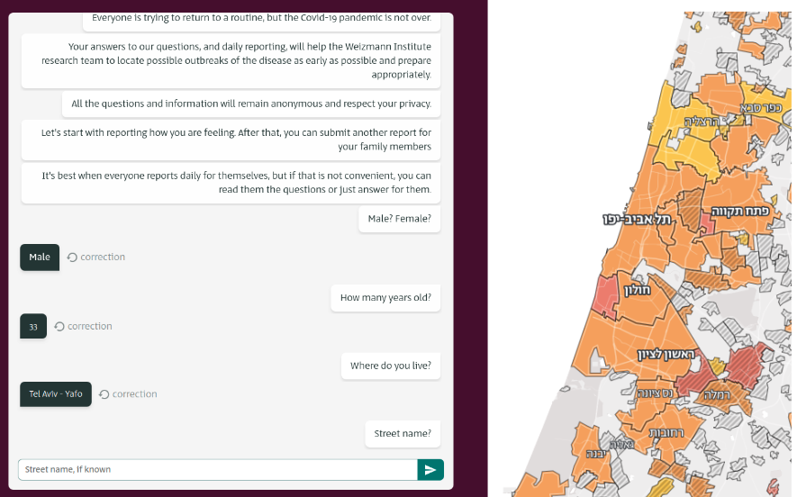

The World Health Organization (WHO) declared the outbreak of corona-virus disease 2019 (COVID-19) a public health emergency of international concern on 30 January 2020 and a pandemic on 11 March 2020.
At that time, there were many unknowns and there was an urgent need to shed light on the nature and impact of virus, and to assist public health officials and policymakers.
In the following I provide a brief overview of the projects I worked on as a researcher at Prof. Eran Segal’s lab at the Weizmann Institute of Science, aimed to develop strategic tools and provide data-driven insights for the public and policy makers.

We devised [national symptoms surveys](https://coronaisrael.org/en/) is Israel (Fig. 1) to gather daily self-reported data and to identify virus spread clusters ([consortium](https://www.nature.com/articles/s41591-020-0929-x), Segal et al. 2020). 
We collected and analyzed the data to study [the effect of a national lockdown on symptoms prevalence](https://www.medrxiv.org/content/10.1101/2020.04.27.20076000v4) (Keshet et al. 2020). 
At that time, there was a limited number of daily COVID-19 tests available in Israel. We used the symptoms report to build [a prediction model to prioritize individuals for testing](https://www.sciencedirect.com/science/article/pii/S2666634020300192) (Shoer et al. 2020). 
Later, by using [data collected from three COVID-19 surveillance platforms in the USA, the UK, and Israel](https://www.sciencedirect.com/science/article/pii/S2589750021001151) (Sudre and Keshet et al. 2021), we were able to further learn about the symptoms that were consistently associated across different countries with a positive COVID-19 test.
We also leveraged the collected data to study the [Stress-related emotional and behavioural impact following the first COVID-19 outbreak peak](https://www.nature.com/articles/s41380-021-01219-6) (Benjamin et al. 2021).

*Figure 1. National daily [symptoms survey](https://coronaisrael.org/en/).*

With the rapid influx of COVID-19 cases leading to an overwhelming burden on healthcare systems, we developed machine learning models to forecast future hospitalizations and deaths. 
During this period, there was a debate in Israel regarding the capacity of hospitals to adequately treat a high volume of severe and critical patients before the hospital load began to affect care. 
The Israeli Ministry of Health had defined the capacity threshold for appropriate care at 800 severely-ill patients.
[Our analysis](https://www.nature.com/articles/s41467-021-22214-z) (Rossman and Meir et al. 2021) demonstrated, as shown in Fig. 2, that even under a moderately high patient load (exceeding 500 severely-ill patients hospitalized countrywide), the in-hospital mortality rate for patients with COVID-19 significantly increased compared to periods of lower patient load (between 250 to 500 severely-ill patients).

*Figure 2. a. In hospital COVID-19 related mortality cases by date. b. Number of COVID-19-related hospitalizations by day in all hospitals in Israel. A threshold of 500 severe and critical patients per day is presented by a dashed horizontal line. Dashed vertical lines separate weeks which are over/under this threshold. c. COVID-19 related deaths for sets of patients that were first hospitalized in different weeks.  X-axis marks the week number.*

  
This model allowed for the analysis of various "what-if" scenarios, projecting the potential consequences of different national strategies. In addition, we conducted a retrospective analysis of data from the Israeli Ministry of Health to investigate the [real-life effect of the BNT162b2 vaccine on the pandemic dynamics](https://www.nature.com/articles/s41591-021-01337-2) (Rossman et al. 2021).

## Key Contributions
- Strategic tools development for policy-makers.
- Data-driven insights for different aspects of the COVID-19 pandemic.

