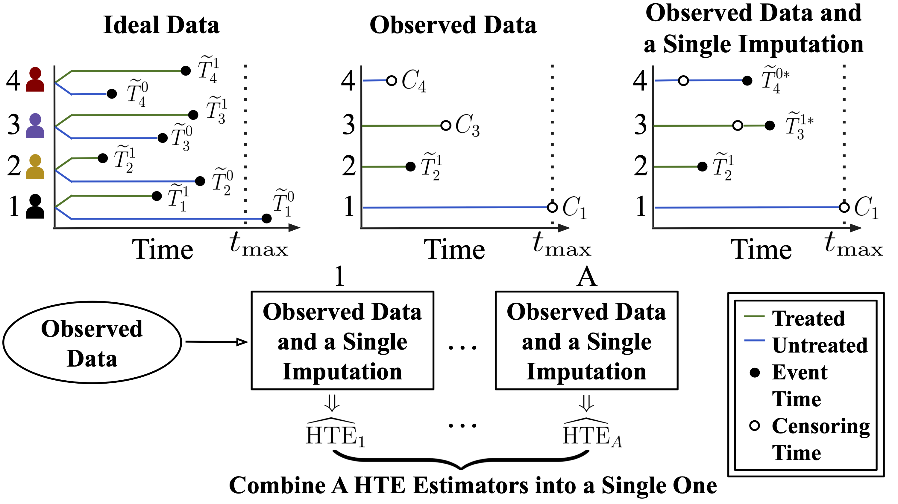

Which cancer treatment would lead to longer survival for each patient? Knowing this would allow us to select the most effective treatment per individual, optimizing outcomes. However, estimating treatment effects is challenging because observed data typically show outcomes for only one treatment per person. Moreover, when the outcome is time until an event like patient death, data are often incomplete due to “right-censoring” – for instance, when subjects drop out or monitoring time is limited.

To address this, we developed MISTR, a new method that constructs multiple datasets with plausible imputations for missing event times. It produces estimates using each imputed dataset and combines them for accurate, personalized treatment effect estimates. Furthermore, most existing approaches require detailed patient characteristics, which are sometimes unavailable. MISTR can bypass this by leveraging “instrumental variables,” a powerful approach for estimating treatment effects without full patient data. We tested MISTR using simulations and real-world medical and economic datasets, demonstrating its superior performance over existing methods, especially under challenging conditions like heavy censoring and unobserved crucial individual characteristics.

## Key Contributions
- MISTR eliminates the need for estimating the censoring mechanism and thus expands the range of cases that can be effectively addressed. 
- MISTR outperforms other existing approaches, especially in heavy censoring rates.
- MISTR can incorporate an instrumental variable for estimating HTE in presence of unobserved confounding.

The full paper details are available at [ICML 2025 website](https://icml.cc/virtual/2025/poster/45413) and [arXiv](https://arxiv.org/abs/2502.01575) 

 
*Figure 1. Our goal is to estimate the heterogeneous treatment effect (HTE), defined as the expected difference in survival times (or their transformation) with and without treatment, conditional on a set of covariates. We propose a multiple-imputation-based estimator that effectively leverages censored observations, outperforms existing methods, and is applicable in settings with instrumental variable adjustment for unobserved confounders.*

