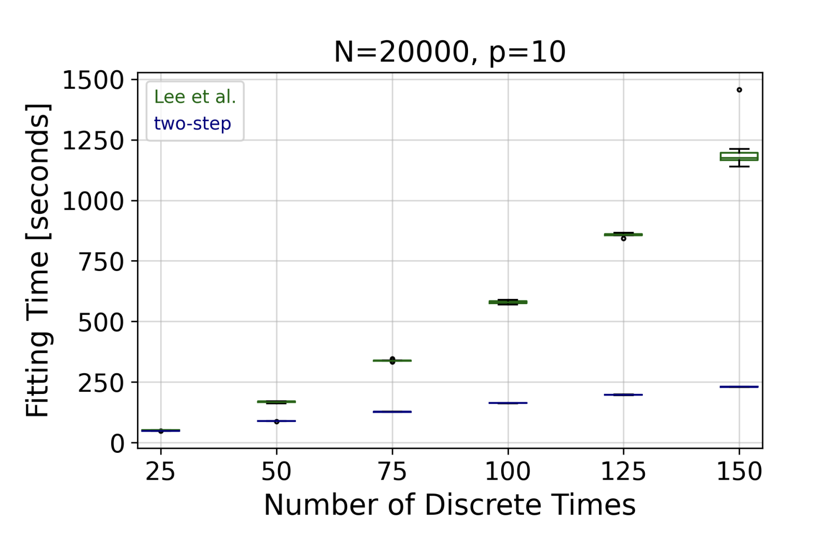

# Discrete-time Survival Analysis with Competing Risks

Time-to-event analysis (survival analysis) is used when the outcome of interest is the time until a pre-specified event occurs. 
Sometimes, the event can be one of several distinct event types, known as competing risks (events).

*Observed number of events in each discrete-time for two competing events*

In this project, we developed a novel estimation procedure for analyzing discrete-time survival data with competing events.
 
The proposed approach offers two key advantages over existing procedures: 
1. It accelerates the estimation process.
2. It allows for straightforward integration and application of widely used regularized regression and screening methods.

In our work, [Discrete-time Competing-Risks Regression with or without Penalization](https://arxiv.org/abs/2303.01186) (Meir and Gorfine, 2023) we illustrate the benefits of our proposed approach by conducting a comprehensive simulation study. Additionally, we showcase the utility of our procedure by estimating a survival model for the length of stay of patients hospitalized in the intensive care unit, considering three competing events: discharge to home, transfer to another medical facility, and in-hospital death.

In addition, we present PyDTS, an open-source Python package for discrete-time survival analysis with competing risks. We present PyDTS along with usage examples in [PyDTS: A Python Package for Discrete-Time Survival (Regularized) Regression with Competing Risks](https://arxiv.org/abs/2204.05731) (Meir et al. 2022) 

## Key Contributions
- The proposed approach performs well in terms of empirical bias and coverage rates.
- It is significantly faster than existing methods
- It allows including modern machine-learning model-selection procedures, such as regularization and screening. 
- PyDTS, an open-source Python package for discrete-time survival analysis with competing events.

*Simulation results - comparison of performance between the proposed two-step approach and the one of (Lee et al., 2018)*

*Simulation results - comparison of fitting time between the proposed two-step approach and the one of (Lee et al., 2018)*

