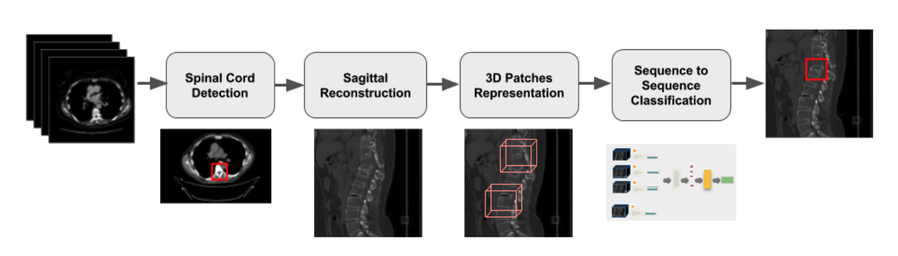

An osteoporosis-related fracture occurs every three seconds worldwide, affecting one in three women and one in five men aged over 50. 
The early detection of at-risk patients facilitates effective and well evidenced preventative interventions, reducing the incidence of major osteoporotic fractures. 
In [this study](https://arxiv.org/abs/2010.03739) (Chettrit and Meir et al., 2020), published in proceedings of MICCAI (2020) conference, we present an automatic system for identification of vertebral compression fractures (VCF) on Computed Tomography (CT) images.
VCF are a medical condition where one or more vertebrae in the spine collapse. This condition, which often remains undiagnosed, can serve as an early indicator for osteoporosis and can initiate treatment.

Due to their volume (in terms of memory footprint), CT scans can pose challenges when are used as-is in training and inference of deep learning algorithms. 
Therefore, our goal is first to obtain a more efficient representation of our region of interest (Fig. 1).
We start by detecting the spinal cord region in the CT scan. Then, we reconstruct a sagittal view of the spine region. We use the reconstructed sagittal and cut the spine region further to small 3D patches that include the vertebrae area.
Lastly, we use a novel sequence to sequence 3D architecture for the classification of the scan as positive or negative to VCF. 
We evaluate several model architectures and representations. In addition, we present a framework combining an ensemble of models that achieves state of the art results, validated on a large data set. 

*Figure 1. Vertebral Compression Fractures Detection Algorithm.*

## Key Contributions
- The proposed system has been employed by healthcare providers to support clinical osteoporosis management. 
- State of the art performance in VCF classification.
- Evaluation of different architectures and representations.